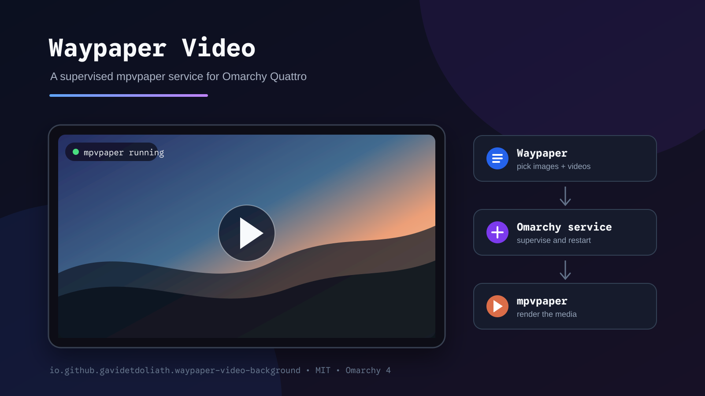

# Waypaper Video pour Omarchy

[English](README.md)

Plugin de service pour Omarchy Quattro qui supervise le fond vidéo `mpvpaper`
sélectionné avec Waypaper. Waypaper reste l'interface graphique de sélection ;
le plugin donne au moteur de rendu un cycle de vie fiable dans `omarchy-shell`.



## Fonctionnalités

- Waypaper gère le dossier de vidéos, la sélection et les réglages.
- Les images du thème et les vidéos Waypaper apparaissent ensemble dans le
  sélecteur Omarchy ouvert avec `Super+Ctrl+Espace`.
- Une dernière tuile **Add** ouvre le dossier personnel du thème courant dans
  le même gestionnaire de fichiers que `Super+Maj+F`.
- Changer de thème remplace la vidéo précédente par l'image par défaut choisie
  par le nouveau thème.
- `mpvpaper` reste au premier plan afin qu'Omarchy Shell supervise son cycle de
  vie.
- Les arrêts inattendus sont relancés avec un délai exponentiel plafonné.
- Les actions démarrer, arrêter, redémarrer, pause et reprise sont exposées en
  IPC.
- La désactivation du plugin ou l'arrêt du shell coupe le moteur supervisé.
- Aucun fichier fourni sous `/usr/share/omarchy` n'est modifié.

## Compatibilité et dépendances

Versions testées :

- Omarchy `4.0.0` (Quattro), schéma de manifeste `1`
- Waypaper `2.8`
- mpvpaper `1.9`

Installation des dépendances qui ne sont pas normalement fournies par
Omarchy :

```sh
omarchy pkg aur add mpvpaper waypaper
omarchy pkg add socat ffmpegthumbnailer
```

Le plugin utilise également `awk` (`gawk`), `pgrep` (`procps-ng`),
`uwsm-app` (`uwsm`), `nautilus` et `setsid` (`util-linux`). Ces éléments sont
normalement déjà fournis par Omarchy.

## Installation sûre

Les plugins Omarchy sont exécutés sans sandbox avec les droits de
l'utilisateur. Vérifie le code avant activation.

```sh
omarchy plugin add \
  https://github.com/GavidetDoliath/omarchy-waypaper-video-background.git
```

Lorsque la commande interactive propose d'activer immédiatement le plugin,
répondre **No**. Le fond statique actuel reste ainsi actif pendant la
configuration. Dans un shell non interactif, le plugin reste désactivé tant
que l'option `--enable` n'est pas fournie explicitement.

Dans Waypaper :

1. choisir `mpvpaper` comme backend ;
2. sélectionner le dossier contenant les vidéos ;
3. choisir une vidéo et le mode de remplissage ;
4. laisser le son désactivé sauf besoin explicite.

Réglages conseillés :

```ini
backend = mpvpaper
mpvpaper_sound = False
mpvpaper_options = hwdec=auto loop-file=inf
```

Vérifier les réglages résolus sans démarrer de fond vidéo :

```sh
~/.config/omarchy/plugins/io.github.gavidetdoliath.waypaper-video-background/start-mpvpaper.sh --check
```

Une fois la vérification réussie :

```sh
omarchy plugin disable omarchy.background
omarchy plugin enable io.github.gavidetdoliath.waypaper-video-background
```

Pour connecter le sélecteur de fond natif d'Omarchy aux images et vidéos :

```sh
~/.config/omarchy/plugins/io.github.gavidetdoliath.waypaper-video-background/selector-integration.sh install
```

Cette étape explicite sauvegarde puis installe trois éléments appartenant à
l'utilisateur : l'action `style.background` du menu, un raccourci Hyprland
direct pour `Super+Ctrl+Espace` et un hook Omarchy `theme-set`. Aucun fichier
système Omarchy n'est modifié. Le sélecteur affiche ensuite les images du thème
courant et les médias des dossiers Waypaper. Les vidéos reçoivent une vignette
avec une pellicule. Le choix est enregistré par Waypaper ; une image fixe met
également à jour le fond de l'écran de verrouillage. Lors d'un changement de
thème, le hook enregistre et affiche automatiquement l'image choisie par ce
nouveau thème. La dernière tuile **Add** crée puis ouvre
`~/.config/omarchy/backgrounds/<thème-courant>/`. Les images ou vidéos copiées
dans ce dossier apparaissent à la prochaine ouverture du sélecteur de ce thème.

## Interface et commandes

Ouvrir Waypaper pour changer de vidéo :

```sh
omarchy-shell waypaper-video-background open
```

Contrôler les sources détectées sans ouvrir le sélecteur :

```sh
~/.config/omarchy/plugins/io.github.gavidetdoliath.waypaper-video-background/background-selector.sh --check
```

Autres commandes :

```sh
omarchy-shell waypaper-video-background status
omarchy-shell waypaper-video-background start
omarchy-shell waypaper-video-background stop
omarchy-shell waypaper-video-background restart
omarchy-shell waypaper-video-background pause
omarchy-shell waypaper-video-background resume
omarchy-shell waypaper-video-background toggle
```

## Mise à jour

```sh
omarchy plugin update io.github.gavidetdoliath.waypaper-video-background
```

## Retour arrière et suppression

Restaurer d'abord le fond statique Omarchy :

```sh
~/.config/omarchy/plugins/io.github.gavidetdoliath.waypaper-video-background/selector-integration.sh remove
omarchy plugin disable io.github.gavidetdoliath.waypaper-video-background
omarchy plugin enable omarchy.background
omarchy plugin remove io.github.gavidetdoliath.waypaper-video-background
```

La suppression ne touche ni à la configuration Waypaper, ni aux vidéos, ni
aux paquets installés.

## Comportement et sécurité

- Lecture de `~/.config/waypaper/config.ini` pour résoudre les réglages.
- Choisir un média autorise explicitement Waypaper à enregistrer ce fond dans
  sa propre configuration.
- L'intégration optionnelle ne modifie que l'extension de menu et les
  raccourcis Hyprland appartenant à l'utilisateur, avec une sauvegarde
  horodatée avant chaque changement. Elle ajoute aussi un hook `theme-set`
  identifié et fournit une commande `remove` symétrique.
- Changer de thème autorise Waypaper à enregistrer l'image par défaut du
  nouveau thème afin qu'elle remplace une éventuelle vidéo précédente.
- Les vignettes vidéo sont mises en cache dans
  `~/.cache/omarchy/waypaper-video-selector/`.
- Activer **Add** autorise explicitement la création du dossier personnel du
  thème courant et son ouverture dans Nautilus. Le plugin ne copie, déplace,
  renomme ou supprime aucun média ajouté dans ce dossier.
- Utilisation du socket Waypaper `/tmp/mpv-socket-<monitor>`.
- Arrêt uniquement du processus `mpvpaper` utilisant ce socket exact avant
  son remplacement.
- Aucun téléchargement, installateur, service système, `sudo` ou `pkexec`.
- Un fond vidéo consomme continuellement des ressources de rendu ; utilise
  pause ou stop sur batterie si nécessaire.

## Diagnostic

### Configuration et état du service

```sh
~/.config/omarchy/plugins/io.github.gavidetdoliath.waypaper-video-background/start-mpvpaper.sh --check
omarchy-shell waypaper-video-background status | jq
qs log -p "$OMARCHY_PATH/shell" --tail 100
```

Après correction d'une erreur de dépendance ou de configuration :

```sh
omarchy-shell waypaper-video-background start
```

## Développement

```sh
./validate.sh
```

Le détail des vérifications locales et des tests restant avant publication se
trouve dans [TESTING.md](TESTING.md).

## Licence

[MIT](LICENSE)
